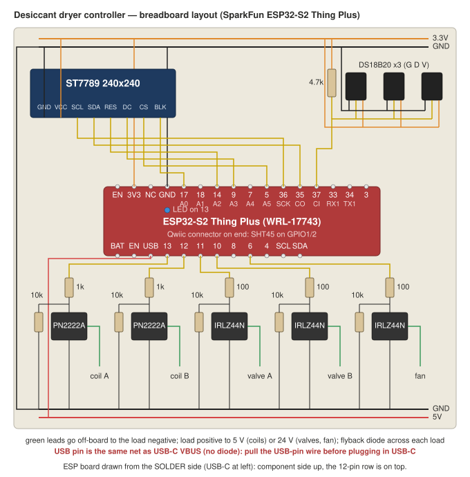
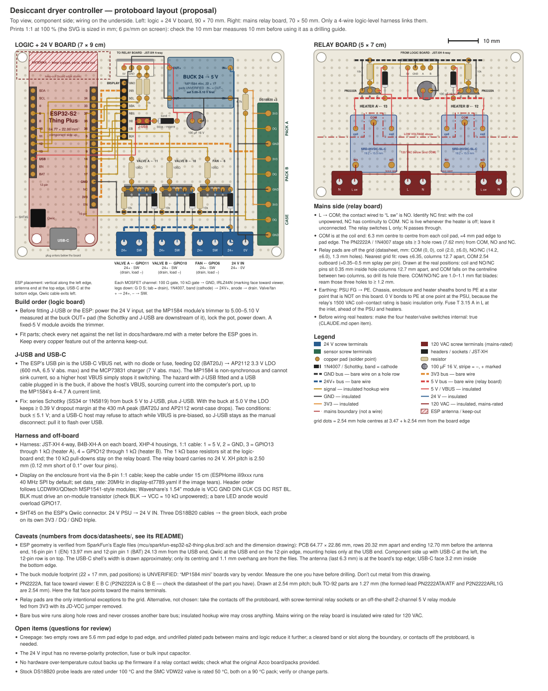

# Hardware

## Bill of materials

| Item | Part | Notes |
|---|---|---|
| MCU | SparkFun ESP32-S2 Thing Plus (WRL-17743) | Feather footprint, Qwiic, CP2102 |
| Humidity/temp | Sensirion SHT45 breakout (Qwiic/STEMMA QT) | In outlet air, after the valves |
| Pack/case temp | 3× DS18B20 (probe style) | Shared 1-wire bus, 4.7 kΩ pullup, 125 °C max |
| Display | 1.54" IPS 240×240, ST7789 | 4-wire SPI, no MISO needed |
| Heater relays | 2× Songle SRD-05VDC-SL-C | 5 V coil ~70 mA, 10 A / 250 VAC contacts |
| Relay drivers | 2× 2N2222 (PN2222) | 1 kΩ base, 10 kΩ base pulldown |
| Valve/fan drivers | 3× IRLZ44N | 100 Ω gate, 10 kΩ gate pulldown |
| Flyback diodes | 5× 1N4007 (or Schottky) | Across every coil/fan, band to + |
| Valves | 2× SMC VDW22QABXB | 24 VDC, 3 W, 2-port NC, brass |
| Fan | 24 V axial | On/off only |
| Supply | 24 V, 1.5 A (e.g. Mean Well LRS-35-24) | Whole system ~12 W |
| Buck | 24 V → 5 V module | Feeds board USB pin and relay coils |
| Heaters | 2× 120 VAC, 123 Ω (~117 W) | Existing packs; switched by relay contacts |

## Board pinout used

From SparkFun's Eagle schematic (J4 = 16-pin, J2 = 12-pin); pin-by-pin
tables and sources in [pinout-verification.md](pinout-verification.md).

16-pin header, in order: EN, 3V3, NC, GND, A0=17, A1=18, A2=14, A3=9, A4=7,
A5=5, SCK=36, COPI=35, CIPO=37, RX1=33, TX1=34, 3.
Used: 3V3, GND, 17 (backlight PWM), 14 (display RST), 9 (display DC),
5 (display CS), 36 (SCK), 35 (MOSI), 37 (1-wire bus).

12-pin header, in order: BAT, EN, USB, 13, 12, 11, 10, 8, 6, 4, SCL=2, SDA=1.
Used: USB (5 V in), 13 (heater A), 12 (heater B), 11 (valve A), 10 (valve B),
6 (fan). Note the "9" and "5" Feather positions are GPIO8 and GPIO4 here.
Qwiic connector: SDA=1, SCL=2, 3.3 V, GND.

On-board blue LED: GPIO13 via 1 kΩ, active high (lights with heater A).
Avoid: GPIO0 (boot button), GPIO19/20 (USB D-/D+), 45/46 (strapping, back
pads only). GPIO18 has an optional pullup (solder jumper, open by default).
GPIO33–37 are free on this quad-SPI module.

## Driver stages

Relay channel (×2):

```
  GPIO ──[1 kΩ]──┬── base   2N2222
                 │          emitter ── GND
              [10 kΩ]       collector ── relay coil ── +5 V
                 │                       (1N4007 across coil, band to +5 V)
                GND
  relay NO contact switches the 120 VAC heater
```

MOSFET channel (×3, valves + fan):

```
  GPIO ──[100 Ω]──┬── gate   IRLZ44N
                  │          source ── GND
               [10 kΩ]       drain ── load ── +24 V
                  │                   (1N4007 across load, band to +24 V)
                 GND
```

At 3.3 V gate drive the IRLZ44N is only partly enhanced (~40–50 mΩ). Fine for
the 125 mA valves and a small fan; not intended for heavy loads.

Package pinouts: 2N2222 TO-92 flat face toward you, legs down: E B C.
IRLZ44N TO-220 tab at back, legs down: G D S. Tab is tied to drain.

## Breadboard layout (bench build)



- Top rails: 3.3 V and GND from the board's 3V3/GND pins.
- Bottom rails: 5 V and GND from the buck converter. 24 V supply negative
  ties to the same ground.
- Board USB pin ← bottom 5 V rail. That pin and the USB-C connector's VBUS
  are one net with no diode between them, so never connect both: pull the
  USB-pin wire before plugging in a USB-C cable, or flash over the air.
  Otherwise the buck and the computer's USB port back-feed each other.
- Display: GND/VCC to top rails; SCL→36, SDA→35, RES→14, DC→9, CS→5, BLK→17.
- DS18B20 ×3: all GND to top GND, all VDD to top 3.3 V, all DQ tied together
  → GPIO37 with one 4.7 kΩ to 3.3 V. Three-wire hookup; do not use parasitic
  power.
- SHT45: Qwiic cable to the board's connector; nothing on the breadboard.
- Five driver columns below the board, one per output. Relays and the 24 V
  loads live off-board; only the coil/load negative lead returns to the
  transistor collector/drain.
- Nothing above 24 V on the breadboard. Heater contacts and mains wiring go
  on the relay module / a terminal block in the enclosure.

## Protoboard layout (proposal)



Two boards, split at the mains boundary rather than by voltage: a 70×90 mm
logic + 24 V board (ESP socketed, buck, three MOSFET channels, 1-wire block,
display header) and a 50×70 mm relay board (relays, 2N2222 stages, 120 VAC
terminals) joined by a 4-wire logic-level harness. Not yet built; the buck
footprint is unverified and the Songle relay pins are not on a 2.54 mm grid.

## Mechanical notes

- SHT45 must sit downstream of both valves so it sees the air actually sent
  to the ozone generator.
- Pack DS18B20s should be clamped to the pack body (not the heater surface,
  not the airspace). Verify surface stays under 125 °C.
- The packs are open to atmosphere: a regenerated pack slowly reabsorbs
  ambient moisture while idle, so don't leave it READY for long. Tune `arm_rh`
  so heating finishes shortly before the swap is needed.
- Ozone-generator feed target is dew point ≤ −40 °C (≈0.4 % RH at 25 °C).
  Cheap RH sensors can't resolve that; the controller only detects the
  humidity *rise* when a pack saturates.
